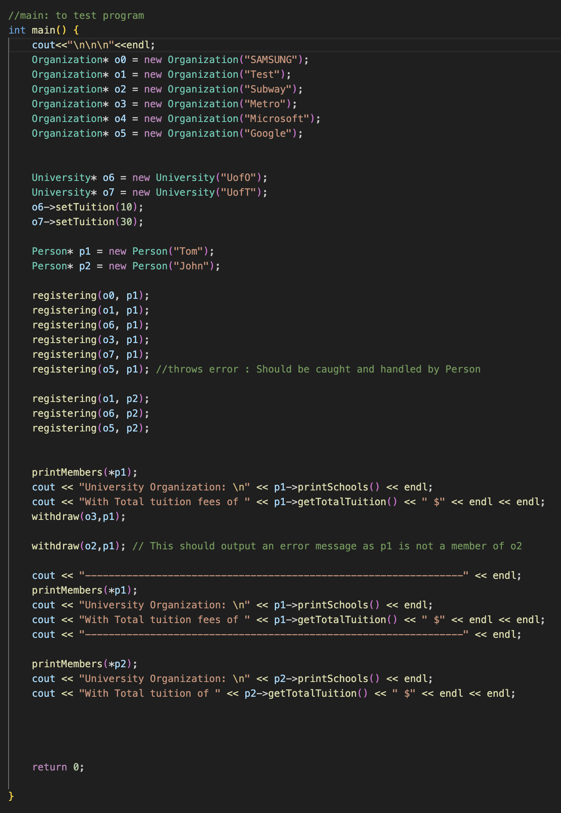
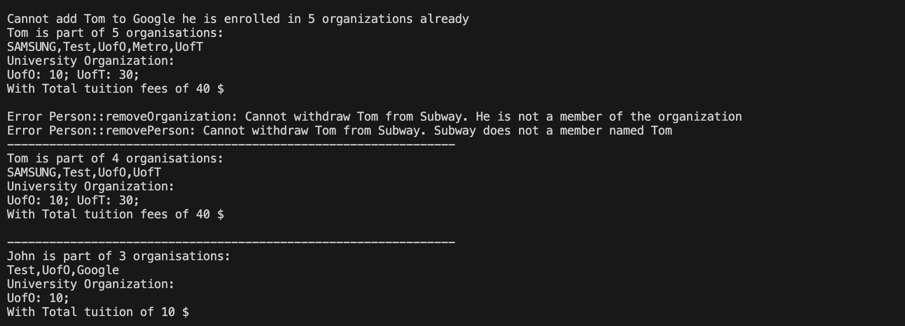

# Occupation-Pro

## Description
This project, "Occupation-Pro," is a C++ console application designed to simulate organizational management, specifically focusing on university and company registrations. It demonstrates dynamic memory management, exception handling, and object-oriented programming principles. The application allows users to register persons in different organizations and universities, handle errors, and calculate total tuition fees for enrolled universities.

## Features
- Management of persons in various organizations and universities.
- Dynamic handling of memberships and registrations.
- Error handling for exceeding maximum organization enrollment.
- Calculation of total tuition fees for university enrollment.

## Key Classes and Functions
- `Organization`: Manages organizational details.
- `University`: Derived from `Organization`, handles university-specific attributes.
- `Person`: Represents individuals with memberships in organizations.
- `Plist`: A template class demonstrating list operations.
- Various utility functions for registration, printing member details, and managing tuition fees.

## Build and Run Instructions

### Prerequisites
- C++ Compiler (e.g., GCC, Clang)
- CMake (version 3.20 or higher)

### Building the Project

#### On macOS and Linux:
1. Clone the repository: `git clone https://github.com/Ebuka01010/Occupation-Pro` (persmsisson may be required to view code)
2. Navigate to the project directory: `cd assignment4`
3. Create a build directory: `mkdir build && cd build`
4. Configure the project: `cmake ..`
5. Build the project: `make`

#### On Windows:
1. Clone the repository using Git Bash or another Git client.
2. Open the project directory in CMake GUI and configure it for your preferred version of Visual Studio.
3. Open the generated solution in Visual Studio and build the project.

### Running the Project
- After building, run the executable `assignment4` from the build directory.

### Cross-Platform Compatibility
The instructions provided are for macOS, Linux, and Windows. Adjustments might be needed for specific setups or versions of development tools.

### Results

##### Main Function

##### Console Output

